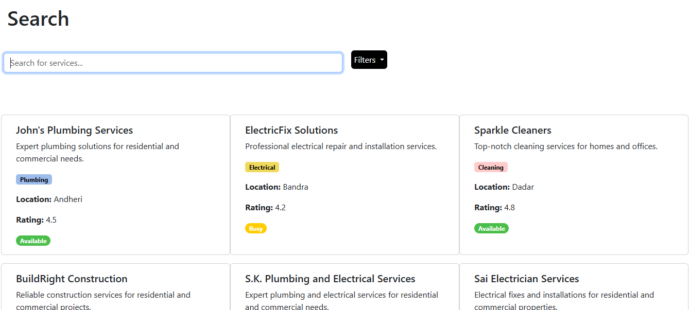
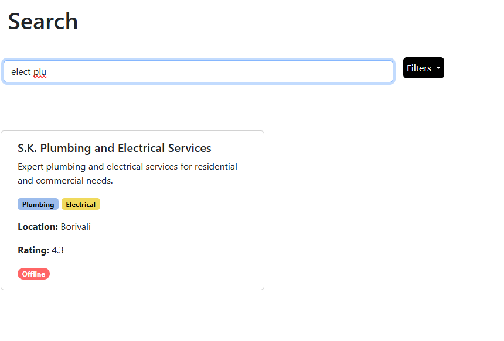
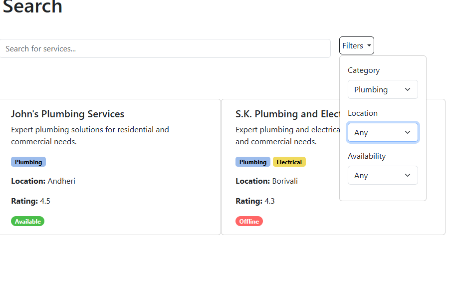
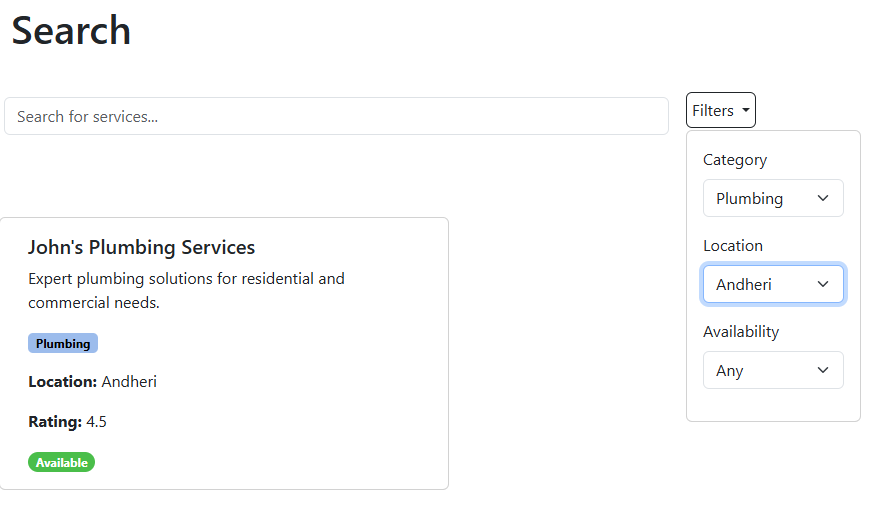
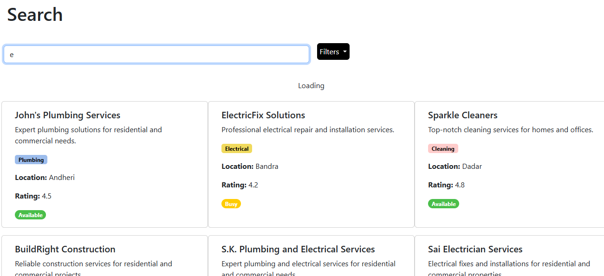
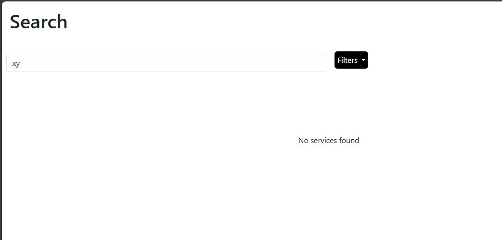
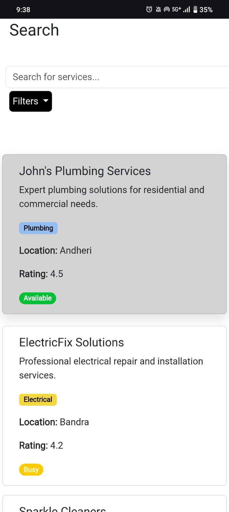
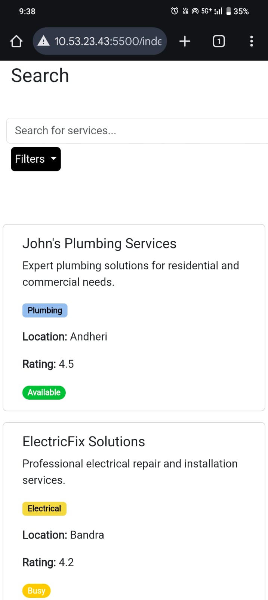

# Local Service Finder

A responsive frontend application to browse and filter local services.

## Project Overview

Local Service Finder is a frontend-only web application that simulates a real-world service discovery platform. The project focuses on core UI and UX behaviors such as real-time search, multi-criteria filtering, loading states, and responsive layouts, without relying on a backend or external APIs.

All interactions are handled entirely on the client side using structured, readable JavaScript. The goal of this project is to demonstrate how dynamic user interfaces can be built with clean logic, clear visual feedback, and responsive design principles.

This project was developed as part of a hackathon case study to showcase frontend development skills and UI behavior simulation.

## Features
- Card-based service listings
- Real-time search
- Filters by category, location, and availability
- Loading state (simulated)
- Empty result state
- Hover effects and smooth UI transitions
- Fully responsive (desktop, tablet, mobile)

## Tech Stack
- HTML
- CSS (Bootstrap + custom CSS)
- JavaScript (Vanilla)

## How to Run
Open `index.html` using Live Server or any browser.

## Screenshots
Below are key UI states demonstrating the core features of the application.

Service Listing Interface:

Search bar with real-time filtering:

FIlter feature:

Loading state:

Empty state:

Mobile view:

